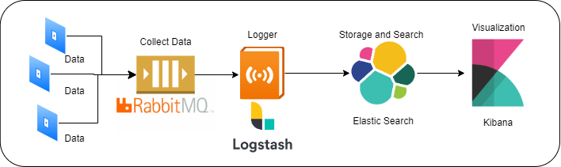

# ES2 Backend

## Environment

[PostgreSQL](127.0.0.1:5432)

[pgAdmin](127.0.0.1:9101)

[RabbitMQ Console](127.0.0.1:15672)

[RabbitMQ](127.0.0.1:5672)

[Kibana](127.0.0.1:5601)

[LogStash](127.0.0.1:5000)

[Elastic Search](127.0.0.1:65536)

Use Elastic Stack Software Structure



This is an initial proof of concept app of how to implement a search feature using Elasticsearch with Django and Vue.js.

Content:
1. [Overview](#1-overview)
2. [Set up the working environment](#2-set-up-the-working-environment)
3. [Set up Elasticsearch & Kibana servers using Docker](#3-set-up-elasticsearch--kibana-servers-using-docker)
4. [Run Django server](#4-run-django-server)


## 1. Overview

In this web application users can add new articles by providing a title and the content of the 
article, and some tags if they want. They can also search for articles from the “Articles list”.

## 2. Set up the working environment

### Use Docker-Compose to set up Environment

```shell
docker-compose up -d
```

After running the command above the output should look like below:

```commandline
Starting elasticsearch ... done
Starting kibana        ... done
Staring RabbitMQ       ... done
Staring PostgreSQL     ... done
Staring PgAdmin        ... done
Starting LogStash      ... done
```

2.2 Install dependencies into an isolated environment:

```commandline
pipenv install
```


> Note: The command `docker-compose up -d` should be run from the root directory because that's where 
> docker-compose script lives.

## 3. Run Django server

From your terminal run this command to start a local web server: 

```commandline
pipenv run python manage.py runserver
```

And in your terminal you will see an output similar to the one below:

```commandline
Watching for file changes with StatReloader
Performing system checks...

System check identified no issues (0 silenced).
July 01, 2021 - 21:06:12
Django version 3.2.3, using settings 'django_elasticsearch.settings'
Starting development server at http://127.0.0.1:8000/
Quit the server with CONTROL-C.
```

You can copy the url `http://127.0.0.1:8000/` from the output and paste it directly to your browser's search bar.

Alternatively, you can click at the link `http://127.0.0.1:8000/` from the output while pressing the `Command ⌘` key, and it
will open a new browser tab for the web application.


